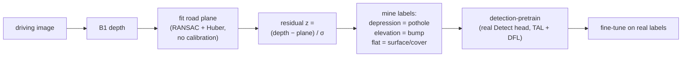
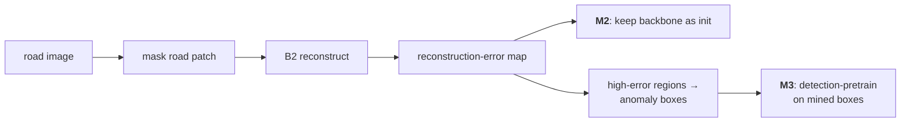
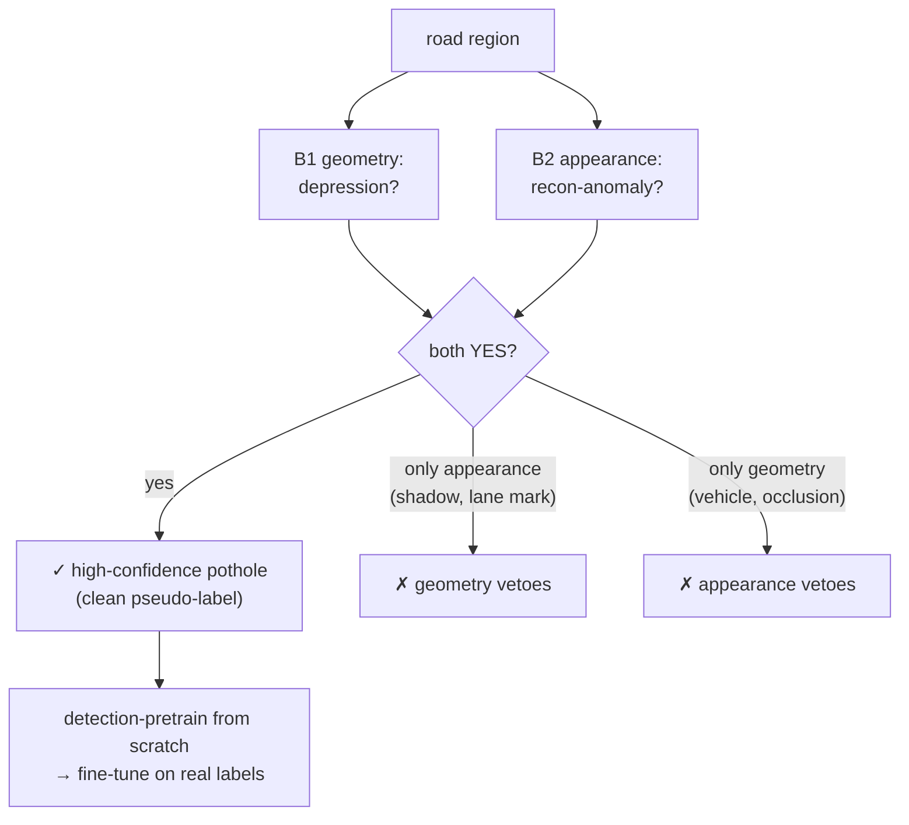

# Beating COCO the Pure Way — Self-Contained Detection Pretraining Options

> **Goal.** Pretrain a small real-time YOLO detector so that, after fine-tuning on a
> few pothole labels, it **beats** a COCO-detection-pretrained init on pothole /
> road-anomaly detection under the leakage-proof LOSO protocol.
>
> **Hard purity constraint.** *No external pretrained models anywhere, and no COCO
> parts anywhere.* No Depth-Anything, no DINOv2, no VLMs, no COCO weights, no COCO
> replay. **Every component is trained from scratch on our own data.** External
> *sensor ground truth* (LiDAR, stereo) is allowed — that is a measurement, not a model.

## The reframe

This is **not** "generic SSL vs COCO." It is:

> **geometry- / reconstruction-supervised DETECTION-pretraining**  vs  **COCO detection-pretraining.**

Both recipes produce a *detector initialization*; we compare inits head-to-head. The
job of our pretraining is to teach the detector to **localize road-surface anomalies**
using supervision that nature (geometry, appearance regularity) gives us for free —
never a human label, never a borrowed model.

## Why every prior attempt only *tied* COCO

The project has a measured wall. Each failure has the same shape — a **single**,
in-domain signal that is either **redundant with COCO** (generic appearance/invariance →
ties, root cause C5) or **decision-relevant but too noisy to trust as a label** →
the detector learns the noise → ties. The measured root causes:

| Code | Root cause |
|------|------------|
| C1 | Catastrophic forgetting (full SSL erases general features) |
| C2 | Representability wall (a 3M student can't fit a large teacher's features; R²≈0.27) |
| C3 | Static-target exhaustion (frozen feature targets die by epoch 2) |
| C4 | Rank collapse (single-axis objectives fall to a low-rank subspace) |
| C5 | Spatial blindness / neck mismatch (generic invariance ≠ what the Detect head needs) |
| C6 | Protocol favors COCO; small deltas buried under fold variance |

**The escape levers**, all used below:

1. **Detection-shaped, task-aligned** pseudo-labels (real Detect head + assigner) — not generic features (dodges C5).
2. A signal **COCO is structurally blind to** (road-surface geometry / anomaly), so the pretraining adds something new.
3. **Consensus of two decorrelated signals** for label precision — the one construction that structurally aims at *beat*, not *tie*.
4. Everything **trained from scratch on our own data** — no external model, no COCO.

---

## Building blocks

Two small components, each self-contained and COCO-free. The four methods are all
assembled from these two.

### B1 — Own depth teacher

- **Input GT:** A2D2 LiDAR + Cityscapes stereo/disparity — *real sensor depth*, a
  measurement, not a model.
- **Train:** a small monocular depth network **from scratch** on the ~50K pool images
  that carry depth GT.
- **Infer:** dense depth on the full ~181K pool (train on the ~50K-with-GT subset,
  run on all 181K).
- **Output:** a per-image depth map used only to *derive labels* — the depth net
  itself never ships in the detector.

### B2 — Own reconstruction / inpainter

- **Train:** mask road-region patches and learn to reconstruct ("heal") them, from
  scratch, on the pool.
- **Learns:** the *normal-road* manifold. Wherever the model **cannot** reconstruct
  the actual pixels, the region is anomalous (pothole, crack, manhole, patch).
- **Output:** (a) a pretrained backbone, and (b) a per-image reconstruction-error map.

```mermaid
flowchart TD
    subgraph SRC["Our data only — no external models"]
        LIDAR["A2D2 LiDAR GT"]
        STEREO["Cityscapes stereo GT"]
        POOL["181K unlabeled driving images"]
    end

    LIDAR --> B1
    STEREO --> B1
    POOL --> B1
    POOL --> B2

    B1["<b>B1</b> — Own depth net<br/>(scratch, from sensor GT)"]
    B2["<b>B2</b> — Own reconstruction net<br/>(scratch, road inpainting)"]

    B1 --> M1["<b>M1</b> Geometry-TERRA"]
    B2 --> M2["<b>M2</b> Representation init"]
    B2 --> M3["<b>M3</b> Anomaly-mining"]
    B1 --> M4["<b>M4</b> Consensus"]
    B2 --> M4

    M2 -. "M2 ⊂ M3" .-> M3
    M1 -. "M4 = M1 ∧ M3" .-> M4
    M3 -. .-> M4
```

---

## The four methods

### M1 — Geometry-TERRA *(needs B1)*

**Idea.** A pothole is, by definition, a **depression** below the road plane. Fit the
road surface from our own depth, take the residual, and turn it into detection labels.

**Pipeline.**



*Sign note: in inverse-depth space a pothole is farther than the plane, so its residual
is negative (a depression); an elevation (speed bump) is positive.*

- **Why it can beat COCO:** injects **3-D surface geometry**, which COCO's object
  supervision never encodes; supervision is **detection-shaped** (dodges C5) and varies
  per image (dodges C3).
- **Main risk:** the **vehicle / occlusion problem** — vehicles read as false
  elevations, occlusions break the plane fit, and shallow potholes may sit near the
  depth-noise floor. A road-region / object gate is mandatory.

### M2 — Representation reconstruction init *(needs B2)*

**Idea.** Use B2's reconstruction task purely as **representation learning** (MAE /
SparK style); transfer the pretrained backbone and fine-tune a detector on it.

- **Why it can help:** a domain-matched, content-pressuring init (dodges C4).
- **Main risk / honest read:** this is a **generic** objective — the same family
  (contrastive, pretext) that already *tied/lost* to COCO here. Best treated as the
  **safe floor**, most likely a tie on its own.

### M3 — Anomaly-mining reconstruction *(needs B2; **contains M2**)*

**Idea.** Turn B2's reconstruction-error map into **detection labels**: high-error
road regions become mined anomaly boxes; detection-pretrain on them, then fine-tune.



- **Why it beats M2:** **detection-shaped and task-aligned** — trains the real Detect
  head + neck, exactly the piece generic SSL lacked (dodges C5).
- **Main risk:** the anomaly signal is **appearance**, i.e. COCO's *own* modality, so it
  is more likely COCO-feature-recoverable → higher tie risk than geometry. Also label
  **purity**: shadows, tar patches and lane marks look anomalous too.
- **Note:** building M3 gives you **M2 for free** (the reconstruction model *is* M2's
  stage 1), so "try both" is a single staged experiment, not two projects.

### M4 — Geometry ∧ Appearance consensus *(needs B1 + B2)* — **headline bet**

**Idea.** Two independent, label-free, COCO-free pothole finders — **geometry** (B1) and
**appearance** (B2) — must **agree** before a pseudo-label is kept. Their mistakes are
*decorrelated*, so the agreement is clean.

| Finder | Fires on a pothole because… | Its false positives |
|--------|-----------------------------|---------------------|
| **Geometry** (B1) | the road dips below its plane | vehicles (false elevation), occlusions, far field |
| **Appearance** (B2) | the road can't be reconstructed | shadows, tar patches, lane marks, wet spots |

Because a **shadow** has no geometric depression and a **vehicle** is not a road-surface
recon-anomaly, each finder **vetoes the other's mistakes**:



- **Why it structurally aims at *beat*, not *tie*:** a single noisy teacher makes the
  detector learn its noise (→ tie). Two decorrelated teachers **agreeing** produce
  clean, pothole-specific labels — and the *agreement itself* is information neither
  COCO nor either single signal has. This is the one lever that answers the
  correlated-noise objection that sank every single-teacher attempt.
- **Main risk:** if both finders fail on the **same hard tail** (small, far, low-contrast
  potholes) their errors *re-*correlate and the consensus set on that tail is thin.
  Highest engineering cost (both B1 and B2).

---

## How the four relate

- **B1** feeds M1 and M4. **B2** feeds M2, M3, M4.
- **M2 ⊂ M3** — the reconstruction model is M2's stage 1; M3 adds the detection head.
- **M4 = M1 ∧ M3** — consensus of the geometry and appearance finders.
- Training your own depth net ("Depth-Anything from scratch") is the **B1 building
  block**, not a standalone method: a depth net is a *teacher*, not a pothole detector.

## Comparison

| | **M1** Geometry | **M2** Repr-recon | **M3** Anomaly-mine | **M4** Consensus |
|---|:---:|:---:|:---:|:---:|
| Needs | B1 | B2 | B2 | B1 + B2 |
| Self-contained / COCO-free | ✓ | ✓ | ✓ | ✓ |
| Detection-shaped supervision | ✓ | ✗ (generic) | ✓ | ✓ |
| Vehicle / occlusion robust | ✗ | ✓ | ✓ | partial (appearance vetoes) |
| Collapse-resistant | ✓ | ✓ | ✓ | ✓ |
| Beat-vs-tie outlook | medium | low (tie-leaning) | medium | **highest** |
| Engineering cost | medium | low | medium | high |
| Role | active bet | **floor** | active bet | **headline bet** |

## Shared kill-gate — the one cheap test before any big training

All four live or die by the same measurement, run **before** committing GPU:

> On labeled data, are the **mined anomalies** good enough as pothole labels —
> **purity × volume × small-pothole coverage** — and do they carry **more** than a fair
> non-COCO baseline already recovers (stratified redundancy / pothole-vs-normal-road
> AUROC)?

If the mined set is impure (dominated by shadows / lane marks) or only recovers the big,
obvious potholes a fine-tune already gets, the method is a tie by construction — **kill
it there.**

## Recommended build sequence

1. **Build B2** (reconstruction net) → get **M2** (init/floor) for free and unlock **M3**.
2. **Build B1** (own depth net from sensor GT) → unlock **M1** and enable **M4**.
3. **M4 (consensus)** is the headline *beat* bet; **M1 / M2** are floors; **M3** is the
   appearance-only *beat* attempt.

Two building blocks, four bets — not four separate projects.
